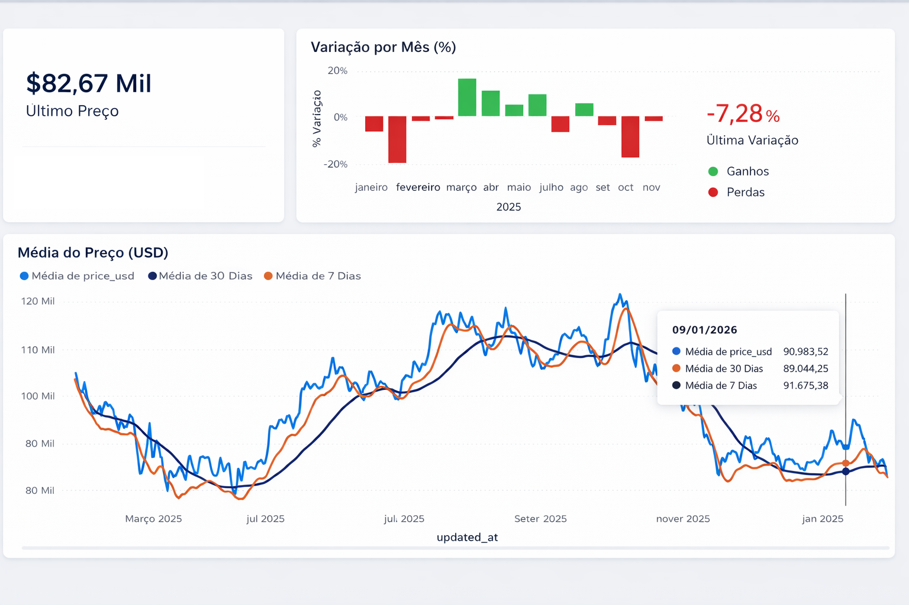

# 🪙 Bitcoin Market Analytics | Engenharia de Dados End-to-End


> **Resumo Executivo:** Pipeline de dados completo (ELT) simulando um ambiente corporativo moderno (Lakehouse). O projeto extrai dados do mercado de criptomoedas, processa via dbt seguindo a arquitetura Medallion e entrega KPIs de volatilidade e tendência para tomada de decisão estratégica.

---

## 🖼️ Visualização do Projeto


*(Painel final no Power BI: Monitoramento de Preço, Volatilidade e Tendências)*

---

## 🏗️ Arquitetura da Solução (Medallion)

O pipeline foi desenhado com foco em **governança, qualidade de dados e escalabilidade**.

```mermaid
graph LR
    subgraph "Ingestão (Raw)"
    A[API CoinGecko] -->|Python Script + Pandas| B[(Supabase PostgreSQL\nCamada Bronze)]
    end
    
    subgraph "Transformação (dbt Core)"
    B -->|Limpeza & Deduplicação| C[(Camada Silver\nStaging)]
    C -->|Regras de Negócio & KPIs| D[(Camada Gold\nMarts)]
    end
    
    subgraph "Consumption (Analytics)"
    D -->|Direct Query| E[Power BI Dashboard]
    end